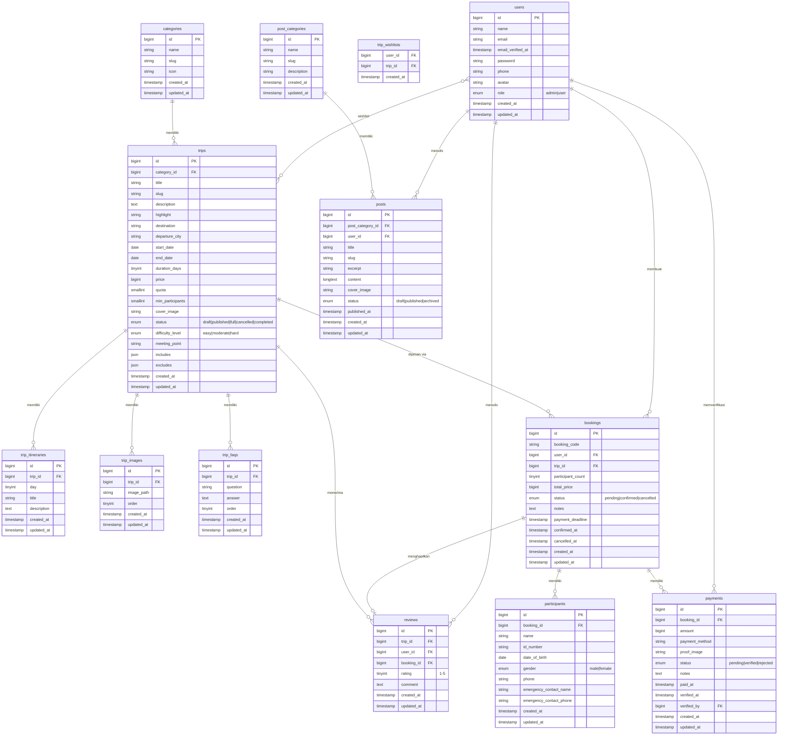

# Entity Relationship Diagram — TripKuy

---

## Ringkasan Tabel

| Tabel | Deskripsi |
|-------|-----------|
| `users` | Akun user dengan role admin/user |
| `categories` | Kategori trip (Petualangan, Pantai, dll) |
| `trips` | Data open trip: jadwal, harga, kuota, status |
| `trip_itineraries` | Jadwal harian per trip |
| `trip_images` | Galeri foto trip |
| `trip_faqs` | FAQ per trip |
| `trip_wishlists` | Pivot: trip yang disimpan user |
| `bookings` | Pemesanan trip oleh user |
| `participants` | Data peserta per booking |
| `payments` | Bukti pembayaran + status verifikasi |
| `reviews` | Ulasan & rating trip (1 booking = 1 review) |
| `post_categories` | Kategori artikel blog |
| `posts` | Artikel blog dengan konten HTML |

## Ringkasan Relasi

| Relasi | Jenis |
|--------|-------|
| Category → Trips | One-to-Many |
| Trip → Itineraries | One-to-Many |
| Trip → Images | One-to-Many |
| Trip → FAQs | One-to-Many |
| Trip → Bookings | One-to-Many |
| Trip → Reviews | One-to-Many |
| User ↔ Trip (wishlist) | Many-to-Many |
| User → Bookings | One-to-Many |
| User → Reviews | One-to-Many |
| User → Posts | One-to-Many |
| User → Payments (verifikasi) | One-to-Many |
| Booking → Participants | One-to-Many |
| Booking → Payments | One-to-Many |
| Booking → Review | One-to-One |
| PostCategory → Posts | One-to-Many |
